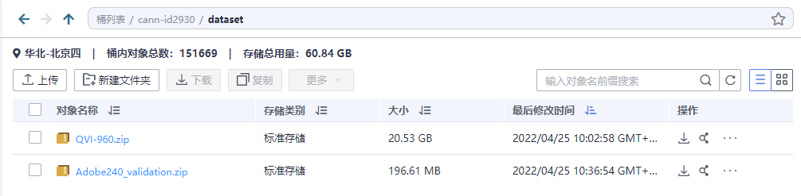
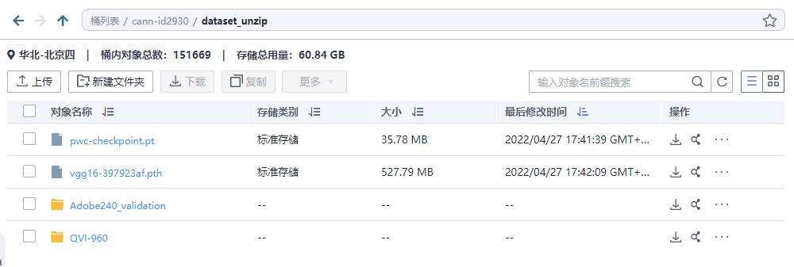
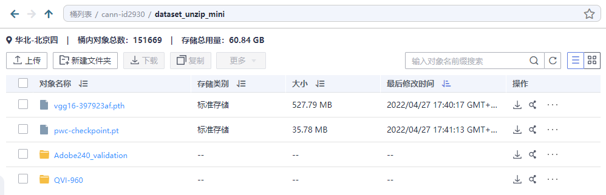
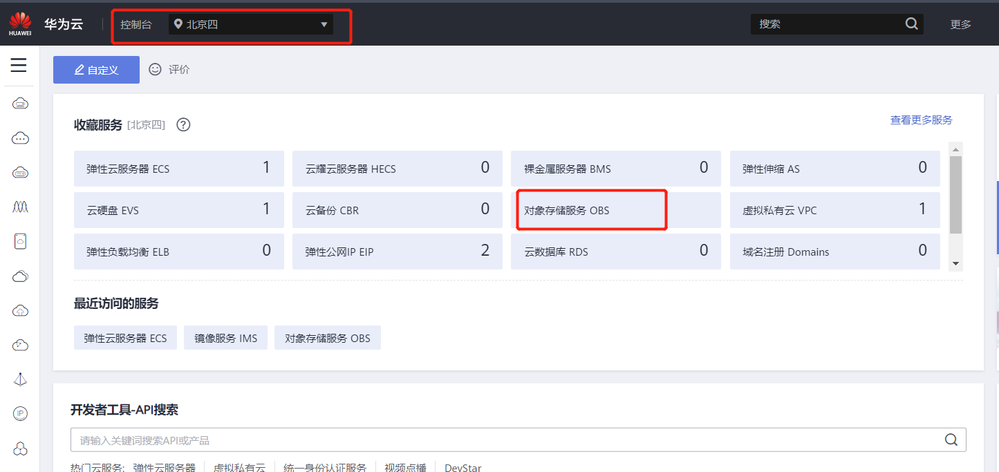
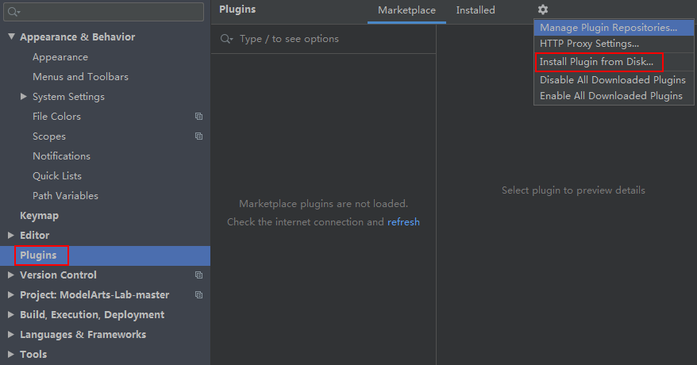
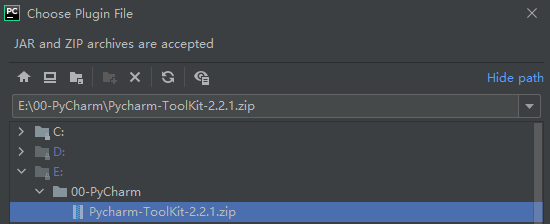
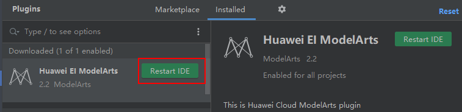
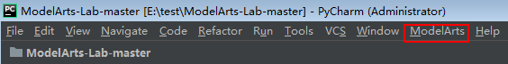
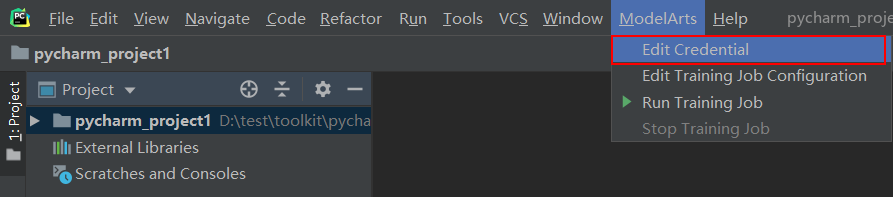
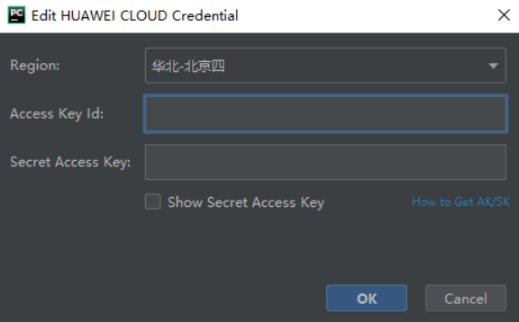

# 使用华为昇腾卡训练
> 为了减少课题组后期重复工作，请大家star这个项目，如果有教程补充的提交pull request，如果有任何项目相关问题请提交issue到[官方仓库](https://gitee.com/ascend/modelzoo/issues)，解决了的issue再提交到此处留档，方便后期研究。

## 准备数据到OBS
> 不需要直接将数据上传到服务器

1. 将数据集压缩包上传至OBS桶的`dataset`文件夹内。
2. 在本地解压后，将数据集上传至`dataset_unzip`文件夹内。
3. 从解压的数据集中只保留数十张，将数据集上传至`dataset_unzip_mini`文件夹内，用于快速调试。
4. 项目中有任何大型静态文件的，将文件各上传至`dataset_unzip`、`dataset_unzip_mini`, 如上图。

## OBS设置桶公开策略

1、登录华为云后，进入控制台，选择 `北京四`。然后点击 `对象存储服务OBS`

2、进入需要公开读的obs桶 

3、找到访问 `权限控制 - 桶策略`。然后点击 创建

4、在公共读写行，点击使用模板创建。

5、最后点击右下角的 `配置确认` ，然后进入第二个页面点击 `创建`。

## 使用pycharm创建modelarts训练任务
>由于AI开发者会使用PyCharm工具开发算法或模型，为方便快速将本地代码提交到ModelArts的训练环境，ModelArts提供了一个PyCharm插件工具PyCharm ToolKit（[插件下载](https://modelarts-pycharm-plugin.obs.cn-north-1.myhuaweicloud.com/Pycharm-ToolKit-latest.zip)），协助用户完成代码上传、提交训练作业、将训练日志获取到本地展示等，用户只需要专注于本地的代码开发即可。

### 在PyCharm中安装ToolKit工具
> 请根据如下操作指导，将下载的ToolKit工具安装至PyCharm中。

1. 打开本地PyCharm工具。
2. 在PyCharm工具中，选择菜单栏的“File > Settings”，弹出“Settings”对话框。
3. 在“Settings”对话框中，首先单击左侧导航栏中的“Plugins”，然后单击右侧的设置图标，选择“Install Plugin from Disk”，弹出文件选择对话框。



4. 在弹出的对话框中，从本地目录选择ToolKit的工具zip包，然后单击“OK”。



5. 单击“Restart IDE”重启PyCharm。在弹出的确认对话框中，单击“Restart”开始重启。



6. 重启成功后，打开一个Project，当PyCharm工具栏出现“ModelArts”页签，表示ToolKit工具已安装完成。



### 创建访问密钥（AK和SK）
> 见之前的pdf步骤三或步骤四。

### 登录ModelArts
1. 打开已安装ToolKit工具的PyCharm，在菜单栏中选择“ModelArts > Edit Credential”。



2. 在弹出的对话框中，选择您使用的ModelArts所在区域、填写AK、SK，然后单击“OK”完成登录。
    - “Region”：从下拉框中选择区域，目前支持“华北-北京四”、“华北-北京一”和“华东-上海一”区域，必须与ModelArts管理控制台在同一区域。
    - “Access Key ID”：填写访问密钥的AK。
    - “Secret Access Key”：填写访问密钥的SK。



3. 查看认证结果。在Event Log区域中，当提示如下类似信息时，表示访问密钥添加成功。
`16:01Validate Credential Success: The HUAWEI CLOUD credential is valid`.

## 适配NPU
> 当前在线对接方案优点在于保证在昇腾AI处理器上训练与GPU的使用方式和风格保持一致。用户在使用在线对接方案时，只需在Python侧和Device相关操作中，指定device为昇腾AI处理器，即可完成用昇腾AI处理器在PyTorch对网络的开发、训练以及调试。针对单P模型训练，主要迁移改动如下(说人话就是所有`.cuda()`替换成`.npu()`之类的)。

### 修改CUDA相关代码

迁移前GPU代码：

```python
CALCULATE_DEVICE = “gpu:0”  
torch.cuda.set_device(CALCULATE_DEVICE)
# 放到device的两种方法  
model = model.cuda() # 写法1
model = model.to(CALCULATE_DEVICE) # 写法2
# 将输入也从host放到device
images = images.to(CALCULATE_DEVICE)
target = target.to(CALCULATE_DEVICE)
torch.tensor([1,2,3],dtype=torch.long,device='cuda')
torch.cuda.BoolTensor([1,2,3])
```

迁移到昇腾AI处理器上代码为：

```python
CALCULATE_DEVICE = “npu:0”   
torch.npu.set_device(CALCULATE_DEVICE)   
# 放到device的两种方法   
model = model.npu() # 写法1
model = model.to(CALCULATE_DEVICE) # 写法2
# 将输入也从host放到device
images = images.to(CALCULATE_DEVICE)
target = target.to(CALCULATE_DEVICE)
torch.tensor([1,2,3],dtype=torch.long,device='npu')
torch.npu.BoolTensor([1,2,3])
```
### 添加ModelArts入口脚本
> 新建文件`modelarts_entry_train.py`, 代码如下, 具体功能自己看注释不再解释

```python
import os
import argparse
import sys

# 解析输入参数data_url
parser = argparse.ArgumentParser()
parser.add_argument("--data_url", type=str, default="/home/ma-user/modelarts/inputs/data_url_0")
parser.add_argument("--train_url", type=str, default="/home/ma-user/modelarts/outputs/train_url_0/")
config = parser.parse_args()


def run(cmd):
    """显示终端输入"""
    print(f"> {cmd}")
    os.system(cmd)


if __name__ == '__main__':
    # 安装依赖包(按需添加) 开始
    run("pip3 install easydict")
    run("pip3 install tensorboardX")
    run("pip3 install opencv-python")
    # run("pip list")
    # 安装依赖包 结束

    # 初始化终端(不要修改) 开始
    code_dir = sys.path[0]
    print("[CANN-Modelzoo] code_dir path is [%s]" % code_dir)
    os.chdir(code_dir)  # cd code_dir
    run("ls -ahl %s" % code_dir)
    # 初始化终端 结束

    # 查看数据集是否配置正确(不要修改) 开始
    print("[CANN-Modelzoo] dataset: %s" % config.data_url)
    run("ls -ahl %s" % config.data_url)
    run("npu-smi info")
    # 查看数据集是否配置正确 结束

    # 加入、添加下面代码到你的脚本(xx.py)中以支持传参(必须修改) 开始
    # parser = argparse.ArgumentParser()
    # parser.add_argument("--data_url", type=str, default="/home/ma-user/modelarts/inputs/data_url_0")
    # config = parser.parse_args()
    # 修改你的脚本以支持传递数据集等位置 结束

    print(f"{'#' * 30} your log start {'#' * 30}")

    # 执行训练(按需修改) 开始
    training_script = "cd %s && python3 train.py --config=configs/train_config.py --data_url=%s" % (code_dir, config.data_url)
    print("[CANN-Modelzoo] start run training script:")
    run(training_script)
    # 执行训练 结束

    print(f"{'#'*30} your log end {'#'*30}")

    # 将当前执行目录所有文件拷贝到obs进行备份(不要修改) 开始
    print("[CANN-Modelzoo] finish run train shell")
    run("cp -r %s %s " % (code_dir, config.train_url))
    # 将当前执行目录所有文件拷贝到obs进行备份 结束

    # 查看obs是否接收(不要修改) 开始
    print("[CANN-Modelzoo] after train - list my obs backup files:")
    run("ls -al %s" % config.train_url)
    # 查看obs是否接收 结束

    print("Done")

```

### 修改你的训练脚本代码
> 现在数据集路径是动态传入的，你的脚本中需要接收该参数并替换原来的路径，实例如下：

```python
# 在原来的--config基础上再加入一个参数data_url
parser = argparse.ArgumentParser()
parser.add_argument('--config', type=str, default="configs/test_config")
parser.add_argument("--data_url", type=str, default="/home/ma-user/modelarts/inputs/data_url_0")
args = parser.parse_args()
# 指定到数据集目录下的权重文件待会儿torch.load()
vgg_pth = args.data_url + "/vgg16-397923af.pth"
pwc_pth = args.data_url + "/pwc-checkpoint.pt"
# config.trainset_root开始只是相对路径，加上数据集目录组成绝对路径
config.trainset_root = args.data_url + config.trainset_root
config.validationset_root = args.data_url + config.validationset_root
```

## 完成
> 开始你的踩坑之旅~